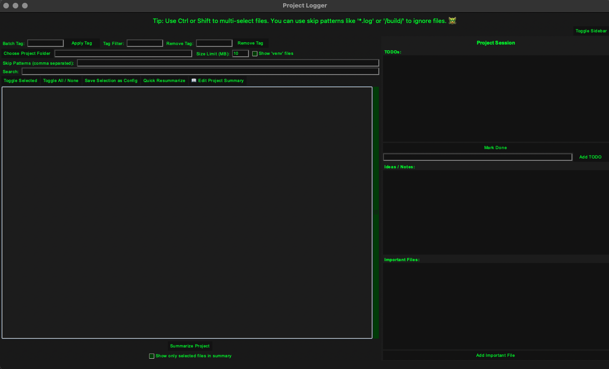
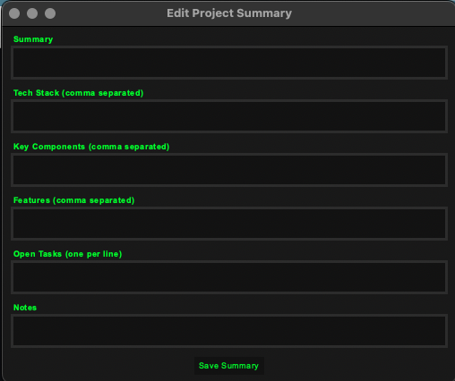

# Plogger - Project Logger

Plogger is a lightweight single script python tool for organizing and documenting code projects. It helps track important files, notes, and tasks — and automatically generates structured txt summaries of entire projects for archvival and use with AI code assistants. 

## Purpose

Plogger creates a living project log that keeps context intact across iterations. It’s especially useful when working with large codebases or when using LLM-based coding assistants: the exported `.txt` summary can be provided as context during prompting to give the model a complete view of your project including file structure.

<p align="center">
  
  
</p>

## How It Works

- Project Overview: Select a folder to view its structure and contents in an interactive tree.  
- Tags and Filters: Tag files, filter by keyword or type, and save selections to a `.plogger` config.  
- Session Memory: Each project stores notes, TODOs, and summaries in a `.psession` file.  
- Summary Generation: Outputs a single text file containing the project structure, selected files, tags, TODOs, and notes.  
- Reusable Context: The resulting text serves as an organized, high-context input for AI code assistants.

## Run

```bash
python Plogger.py
```

Then choose a project folder and click **Summarize Project** to generate your report.
